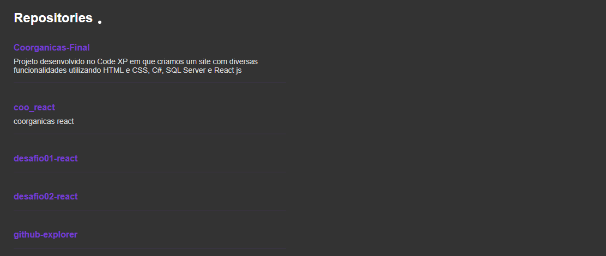

<h1 align="center">github-explorer</h1>

<div align="center">
    
</div>

<h2 align="center">My github repositories, aplication created in Ignit Rocketseat</h2>

### Section
- Repository

### Built With
* React.js
* TypeScript
* Sass

### Installation
1. Clone the repo
   ```sh
   git clone https://github.com/your_username_/Project-Name.git
   ```
2. Install 
   ```sh
   yarn
   ```
   
 ### Usage
 ```sh
   yarn dev
   ```
